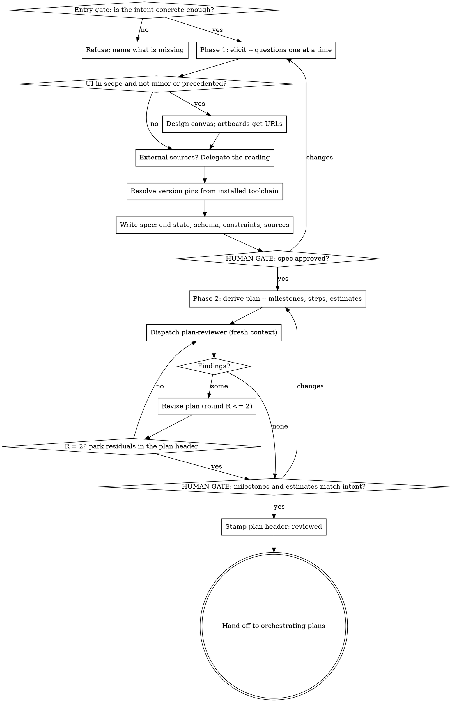

# Plan development and review -- design

Date: 2026-09-10
Status: implemented on branch `plan-development`
Repo: claude-plugins (plugin: plan-execution)

## Why this exists

`plan-execution` turns a multi-step plan into delivered, verified work. Nothing produces the
plan. Today a human hand-writes one and hopes it parses.

It is worse than a convenience gap, because the plugin's own pieces hard-require structure that
no upstream planning skill emits:

- `plan-progress-reporter` reports a **milestone rollup** and "step detail for the current
  milestone and the next one only". A flat step list breaks its contract.
- The same agent has estimate, actual and ratio columns, and `orchestrating-plans` records
  `Step <id> actual: <X>h` against them. Without **per-step estimates**, every ratio is `--`.
- `step-preflight` checks that "a tool is installed at a version" and reports the resolved
  binary path. Without **version pins** in the plan it has nothing to check against.
- `orchestrating-plans` treats the spec as the binding authority and marks rulings made without
  a reachable spec as provisional. Without a **spec**, every ruling in execution is provisional.
- `task-brief` resolves a step by heading or checkbox item and refuses an ambiguous identifier.
  A plan whose step IDs are not unique heading tokens cannot be briefed at all.

So the executor already has a plan format. It was never written down, and nothing enforces it.
This adds the front half: a skill that develops a spec and a plan in that format, and an agent
that reviews the plan adversarially before a single step is dispatched.

## What is being added

| Piece | Kind | Job |
|---|---|---|
| `developing-plans` | skill | interactive, in your session. Gates on intent, elicits a spec, derives a plan, dispatches the reviewer, hands off to `orchestrating-plans` |
| `plan-reviewer` | agent | independent adversarial review of a plan against its spec. Returns findings and queued questions. Reports; never decides |
| `plan-criteria.md` | reference | the single list of what a sound plan must contain. The skill writes against it; the reviewer is handed its path |
| `orchestrating-plans` | existing skill, small edit | intake: no plan -> invoke `developing-plans`; unreviewed plan -> review it before step 1 |

The developer is a **skill, not an agent**, because it holds a conversation with the human. An
agent runs in an isolated context and cannot ask; it would guess answers instead. This is the
plugin's existing rule -- anything that needs continuity and talks to the human stays in session
-- applied one level up from execution.

The reviewer is an **agent, not part of the skill**, for the same reason `harsh-critic` is: an
author cannot grade its own plan. A reviewer that inherited the reasoning behind the plan will
agree with it.

## Decisions taken, and what each costs if wrong

1. **Fork superpowers' planning skills; do not wrap them.** `writing-plans` bakes
   `REQUIRED SUB-SKILL: Use superpowers:subagent-driven-development` into the mandatory header of
   every plan it writes, and its terminal instruction routes the user to that executor or to
   `executing-plans`. Wrapping means every plan this plugin produces points at a competing
   executor, and a superpowers version bump moves the skill under us. Forking also removes any
   runtime dependency on another plugin, which matters now that this one is publicly hosted.
   Superpowers is MIT (c) 2025 Jesse Vincent; derived files carry an attribution line.
   *If wrong:* we maintain a fork that drifts from a better-maintained upstream.

2. **The user brings intent, not a specification.** `developing-plans` has an entry gate: a clear
   statement of what is being built, concrete enough to turn into a project. Phase one
   interrogates that into a formal spec. "Build me an app" is refused with what is missing.
   *If wrong:* the gate rejects work it should have helped with, or admits work too vague to spec.

3. **Milestones, estimates and version pins are proposed by the skill, confirmed by the human.**
   The user is not expected to arrive with any of them. The skill derives milestones from the
   spec, estimates each step, and resolves version pins by querying the installed toolchain. All
   three are put to the human at the plan review gate, whose question is: does this breakdown
   match what you asked for.
   *If wrong:* the human rubber-stamps a breakdown they did not read, and milestone boundaries
   turn out to be wrong once execution is underway.

4. **A step is a heading; sub-tasks are checkboxes.** `task-brief` ends a checkbox step at the
   next checkbox item or the next heading, whichever comes first (`scripts/task-brief:83-86`).
   Numbered checkbox steps with lettered checkbox sub-tasks would truncate every brief at
   sub-task (a) and then trip the empty-body guard at line 137. Steps as headings resolve to the
   whole section down to the next same-or-higher heading (lines 105-110), so sub-tasks travel
   with the step.
   *If wrong:* nothing breaks silently -- `task-brief` fails loudly, which is how this was found.

5. **A step is the smallest unit that carries its own test cycle and is worth a fresh reviewer's
   gate.** Below that line, work is a lettered sub-task. Each step costs six or more dispatches
   in execution (pre-flight, implementer, review package, critic, fix rounds, verifier,
   reporter), so granularity below the reviewable unit doubles overhead without halving work.
   Preference for fine granularity is expressed in sub-tasks, where it is free.
   *If wrong:* steps are too coarse and a critic has to reject a large diff wholesale.

6. **One reviewer, not two.** The spec is gated by the human at the end of phase one; it does not
   get its own adversarial agent. The `plan-reviewer` judges the plan against the spec.
   *If wrong:* a weak spec passes the human gate and the plan faithfully implements it.

7. **The reviewer does not verify premises against the tree.** That is `step-preflight`'s job,
   immediately before each dispatch. The plugin's measured claim is that premises go stale, so
   verifying all of them up front is work thrown away.
   *If wrong:* a plan built on a false premise reaches execution, where pre-flight catches it at
   the cost of one amendment -- which is the designed behaviour, not a failure.

8. **Plan review is capped at 2 revision rounds.** Residual findings are parked into the plan's
   header and carried into the ledger as rulings, so execution inherits them explicitly.
   *If wrong:* a plan ships with a real structural defect that costs fix rounds later.

## The flow



## Piece 1: the `developing-plans` skill

One skill with two phases and a gate between them, rather than two skills. The seam between
"spec done" and "plan started" is exactly where superpowers loses control of its own handoff;
keeping both phases in one skill means nothing can route away mid-flow.

### The entry gate

The skill needs a statement of what is being built that is concrete enough to become a project.
It must be possible to say, from the user's own words, what the thing does and who or what uses
it. If it is not, the skill says what is missing and stops -- it does not elicit a project from
a blank page.

Refused, with the missing piece named: "build me an app", "make the tests better", "modernise
this". Admitted: a paragraph naming the thing, its users, and the outcome that would count as
success.

### Phase 1 -- elicit, then write the spec

Questions one at a time. Explore the repository first, so questions are about what is actually
there. The spec must end up carrying, because downstream pieces require each one:

| Section | Why it exists downstream |
|---|---|
| End state | gives `orchestrating-plans`' final whole-branch review a rubric it currently lacks |
| Global constraints, with version pins | copied verbatim into every dispatch; `step-preflight` checks the pins |
| Data structures | every structure defined exactly once, with field types |
| Design references | artboard URLs the plan's UI steps cite |
| Sources | what was taken from each external source, and whether it is verified |
| Non-goals | so the reviewer can call scope creep |

**UI.** A design pass is required when the work introduces a new screen, or a component with no
existing precedent in the repo, or changes a user-visible flow. It is not required for copy
changes, a field added to an existing form, or restyling inside an established design system.
When required, the canvas is produced in phase one via the `design` skill, before the plan
exists, so the plan's UI steps can cite specific artboards by URL.

The `plan-reviewer` is a text agent and cannot look at a canvas. Design adequacy is therefore
gated by the human at the end of phase one, and never by the reviewer.

**External sources.** Reading is delegated to a research subagent so fetched material never
occupies the session's context. What comes back is recorded in the spec's Sources section:
the source, what was taken from it, and whether it has been verified against the installed
tool. A claim about an API or a configuration key taken from documentation is **unverified**
until something checks it locally -- defect pattern 3 in `orchestrating-plans` ("verify a new
configuration key against the installed tool, never against memory").

**Version pins.** Resolved by querying the installed toolchain, not by asking the user and not
from memory. Record the version and the resolved binary path, the same discipline
`step-preflight` reports under Environment.

**Human gate.** The spec is put to the human for review before phase two begins.

### Phase 2 -- derive the plan

Milestones come from the spec: each one delivers something whole and independently meaningful.
Steps come from the milestones. Estimates are the skill's own, per step, in hours.

Self-review before dispatching the reviewer -- placeholder scan, spec coverage in both
directions, and identifier consistency between steps -- because it is cheaper to catch those
than to spend a review round on them. Then the reviewer, whose findings are the real gate.

**Human gate.** Milestones and estimates are put to the human with one question: does this
breakdown match what you asked for. This is the moment the human sees the shape of the work,
and it is the last cheap moment to change it.

**Handoff.** `orchestrating-plans`, named explicitly. Nothing else.

## Piece 2: the `plan-reviewer` agent

Model: mid-tier, in line with the other reviewers. Tools: read, search, git read-only. It writes
one file, its report.

**Inputs:** the plan file, the spec, the criteria file path, and the review round number.

**Posture:** `harsh-critic`'s, not superpowers'. Superpowers' plan-document-reviewer prompt is
deliberately lenient -- "approve unless there are serious gaps". This one inherits the house
rule instead: finding nothing is a failure of the review, not a pass for the plan.

**What it checks**, in report order:

1. **Spec coverage, both directions.** Every spec requirement maps to a step; every step traces
   to a requirement. Gaps one way are missing work; gaps the other way are scope creep. This is
   the highest-value check and comes first.
2. **The end state.** Are its conditions observable and checkable, and does the last milestone
   actually reach them?
3. **Structure the executor requires.** Milestones present; a per-step estimate; step IDs unique
   as heading tokens; steps as headings with checkbox sub-tasks; global constraints with resolved
   version pins; a spec pointer.
4. **Dependency ordering.** A step consuming something a later step produces. A step whose
   interfaces name nothing.
5. **Right-sizing.** A step no reviewer could reject in isolation. A step that is really five.
6. **Testability.** A step whose success criteria could be satisfied by code that does nothing.
7. **Data structures.** Defined once with types; cited, not restated, by the steps that touch
   them.
8. **Placeholders.** "TBD", "add error handling", "similar to step N", a reference to a type no
   step defines.

**Output:** findings ranked by what they cost during execution, not by document tidiness -- a
missing spec requirement outranks an inconsistent heading. Plus a `NEEDS-HUMAN` section for
questions it cannot settle and the skill should not settle either, in the shape
`step-preflight` already uses.

**Rules it inherits:** report `HOLDS` coverage as well as failures, so a clean review shows what
was covered; state what is true and what it implies, never "the plan should be changed to ...";
fix nothing; US-ASCII only.

## Piece 3: `plan-criteria.md`

One file, in the `developing-plans` skill directory. The skill writes against it; the reviewer is
handed its path in the dispatch, exactly as `step-preflight` is handed the project's guideline
paths. One copy, so the two cannot drift.

It holds the plan format skeleton below, plus the checkable form of each requirement -- the
phrasing a reviewer can fail a plan on. "Schema is obvious" is not checkable; "every data
structure is defined exactly once, with field types, and cited rather than restated" is.

## The plan document format

```markdown
# <Project> Implementation Plan

**Spec:** docs/specs/<file>.md
**Plan review:** passed YYYY-MM-DD, round 2 -- 6 findings closed, 1 parked (see below)
**Executor:** use plan-execution's orchestrating-plans skill

## End state

<observable, checkable conditions -- one per line>

## Global constraints

<one line each, exact values, copied verbatim into every dispatch>
- Language: Python 3.11.9 (resolved: /opt/homebrew/bin/python3.11)
- Framework: <name and version>

## Sources

| Source | What was taken from it | Verified against installed tool |
|---|---|---|

## Parked review findings

| Finding | Why parked | What it costs if it matters |
|---|---|---|

## Milestone M1: <deliverable>

<one line: what exists when this milestone is done>

### Step M1.1: <name>

**Estimate:** 1.5h
**Files:** create / modify (with line ranges) / test -- exact paths
**Interfaces:** consumes <exact signatures> / produces <exact signatures>
**Data structures:** cites spec definitions by name
**Success criteria:** observable and checkable
**Design:** <artboard URL, when the step is UI>

- [ ] a. <sub-task>
- [ ] b. <sub-task>
```

Estimates sit at step level; `plan-progress-reporter` sums them per milestone.

## Piece 4: the `orchestrating-plans` intake edit

A short section at the top of the existing skill, before Setup. Deliberately small -- the skill
is already 338 lines and focused.

- No plan file named -> invoke `developing-plans`. Do not begin execution.
- Plan named, header carries a `**Plan review:** passed` stamp -> proceed to Setup.
- Plan named, no stamp -> dispatch `plan-reviewer` once before step 1, and either revise or park
  its findings as rulings in the ledger.

The stamp lives in the plan's header rather than in the workspace because the workspace is
git-ignored. A plan is committed and outlives its workspace; a review record kept only in
`.plan-execution/` is lost to whoever executes the plan next. The full report still goes to the
workspace; the header carries the verdict.

## What this deliberately does not do

- No spec-reviewer agent. The human gate at the end of phase one is the spec's review.
- No premise verification in the reviewer. That is `step-preflight`'s job, later, per step.
- No wrapping of, or runtime dependency on, superpowers.
- No change to `task-brief`, `review-package` or `plan-workspace`. The format is chosen to fit
  the scripts as they are.
- No new execution behaviour. Everything after handoff is unchanged.

## Open items

1. **Criteria file path resolution.** `orchestrating-plans` refers to `scripts/task-brief`
   relatively today. The reviewer dispatch will refer to the criteria file the same way, for
   consistency. If that convention is fragile in practice it is fragile for the scripts already,
   and should be fixed for both at once rather than solved differently here.
2. ~~README and plugin description.~~ Done: both READMEs, `plugin.json` and
   `marketplace.json` now say the plugin produces the plan as well as executing it, and the
   plugin README carries the superpowers attribution.
