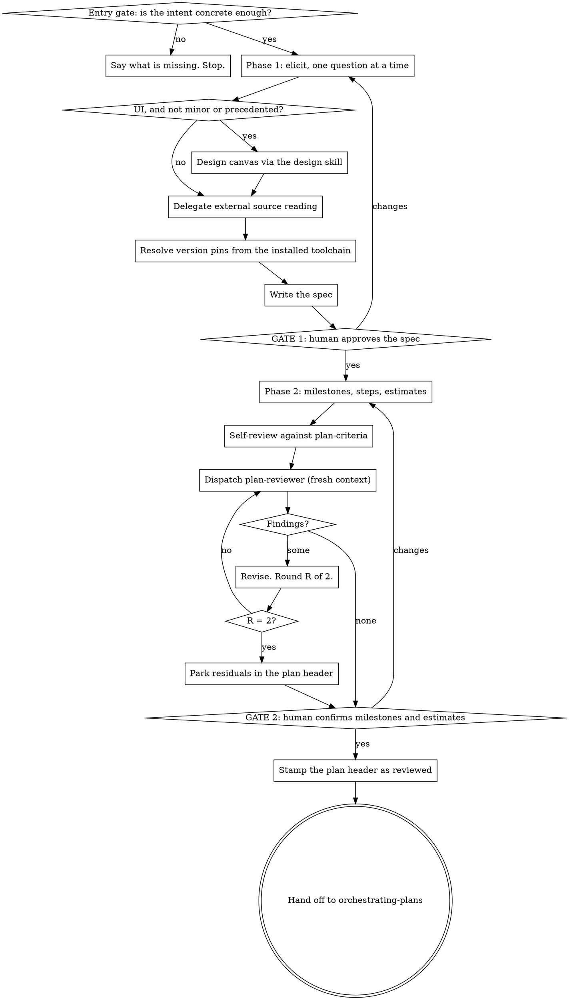

# Developing Plans

You are developing the spec and the plan. You do not build the thing, and you do not review your
own plan -- an agent that did not write it does that.

Announce once at the start: "Using developing-plans to develop a spec and plan for <the work>."

## Why this exists

`orchestrating-plans` executes a plan. Its pieces require structure that a hand-written plan
rarely has: milestones, because the progress reporter rolls up by milestone; per-step estimates,
because the ledger records actuals against them; version pins, because pre-flight checks the
installed toolchain against them; a reachable spec, because without one every ruling made during
execution is provisional; and step IDs that resolve to exactly one heading, because `task-brief`
refuses an ambiguous identifier rather than briefing the wrong step.

So the executor already had a plan format. It was never written down and nothing enforced it.
This is the front half: the format is in `plan-criteria.md`, you write against it, and
`plan-reviewer` fails plans on it.

The other half of why: a plan is cheap to change and expensive to execute. Every defect caught
here costs a paragraph. The same defect caught during execution costs a pre-flight, an
amendment, a ruling, and sometimes a fix round.

## The two phases and the three gates



Read `plan-criteria.md`, in this skill's directory, before you write either document. It is the
format and the standard, and the reviewer is handed the same file.

## The entry gate

You need a statement of what is being built that is concrete enough to become a project. The
test: from the human's own words, can you say what the thing does, and who or what uses it? Not
how it works -- that is what phase one is for.

If you cannot, say which of the two is missing and stop. Do not elicit a project from a blank
page: a spec assembled entirely from your own suggestions is a spec the human has no stake in,
and it fails at gate 1 or, worse, passes without being read.

- Refused: "build me an app", "make the tests better", "modernise this", "I want to use <X>".
- Admitted: a paragraph naming the thing, who or what uses it, and what would count as success.

A refusal is one short message: what you have, what is missing, and an example of what would be
enough. Then stop and wait.

## Phase 1 -- elicit, then write the spec

Explore the repository before your first question, so your questions are about the code that is
actually there rather than the code you assume.

Then questions, **one per message**. Prefer multiple choice where the options are genuinely
enumerable; open-ended where they are not. You are after purpose, constraints, and what would
count as done -- in that order. Stop asking when the answers stop changing what you would write.

If the request spans several independent subsystems, say so before spending questions on detail.
Decompose it, agree which piece comes first, and spec that piece. Each piece gets its own spec,
plan and execution.

### UI

A design pass is required when the work introduces a new screen, or a component with no existing
precedent in this repo, or a change to a user-visible flow. It is not required for copy changes,
a field added to an existing form, or restyling inside an established design system. When you
claim the exception, say so in the spec so the reviewer can see it was a decision.

When required, produce the canvas with the `design` skill **in phase one**, before the plan
exists, so the plan's UI steps can cite specific artboards by URL.

`plan-reviewer` is a text agent and cannot look at a canvas. Design adequacy is settled by the
human at gate 1 and nowhere else. Do not defer a design question to the reviewer; it will check
that the reference exists and is specific, and nothing more.

### External sources

Delegate the reading. Dispatch a research worker per source or per cluster of sources, and have
it report what bears on this work. Fetched documentation that passes through your context stays
resident in it and is re-read on every later turn, which is how a spec conversation runs out of
room before it reaches the plan.

Record every source in the spec's Sources table: the source, what you took from it, and whether
that has been **verified against the installed tool**. Documentation describes some version; the
machine has the one that matters. An unverified claim about an API or a configuration key is a
premise, and it is marked as one so pre-flight knows to check it.

### Version pins

Resolve them yourself, by querying the installed toolchain. Do not ask the human for a version
and do not write one from memory. Record the version **and** the resolved binary path, the same
discipline `step-preflight` reports under Environment -- a machine can carry more than one
toolchain, and the one on PATH is the one that will build.

If the project has no toolchain installed yet, say so in the spec explicitly and pin the version
you intend to install. An intended pin is a premise; an assumed one is a bug.

### Writing the spec

`docs/specs/YYYY-MM-DD-<topic>.md`. Sections, and each one is there because something downstream
needs it: end state, global constraints with pins, data structures, design references, sources,
non-goals. `plan-criteria.md` gives the checkable form of each.

Scale each section to its complexity. Then read it once with fresh eyes for placeholders,
sections that contradict each other, and requirements that could be read two ways -- fix those
inline rather than shipping them to the reviewer.

**Gate 1.** Put the spec in front of the human and wait. Say plainly that this is the last cheap
moment to change direction.

## Phase 2 -- derive the plan

Milestones first, from the spec: each one delivers something whole and independently meaningful,
and its one-line deliverable says what exists when it is done. Do not ask the human to supply
the breakdown -- deriving it is your job, and confirming it is theirs at gate 2.

Then steps within each milestone, then the lettered sub-tasks within each step. A step is the
smallest unit that carries its own test cycle and is worth a fresh reviewer's gate; below that
line, work is a sub-task. Fold setup, configuration and scaffolding into the step whose
deliverable needs them.

Then an estimate per step, in hours, as your own honest figure. The ledger records the measured
actual against it and the reporter prints the ratio, so a padded estimate is not a safety margin
-- it is a broken instrument.

Write it to `docs/plans/YYYY-MM-DD-<topic>.md`, in the skeleton from `plan-criteria.md`.

### Self-review, then the reviewer

Run the criteria against your own plan first -- section C especially, because those failures are
mechanical and it is a waste of a review round to find them. Then dispatch `plan-reviewer` on a
mid-tier model with: the plan path, the spec path, the path to `plan-criteria.md`, the round
number, and the report output path.

Findings are the reviewer's; the decisions are yours. For each one, either fix the plan, or
decide it does not matter and be able to say why. **Two rounds.** After round 2, any finding
still open goes into the plan's `## Parked review findings` table -- the finding, why it is
parked, and what it costs if it turns out to matter -- so execution inherits it explicitly
instead of rediscovering it in a fix round.

A reviewer that returns nothing on round 1 has not looked hard enough. Send it back to spec
coverage and to D3 before you accept a clean plan.

### Gate 2 and the handoff

Put the milestone list and the estimates in front of the human with one question: does this
breakdown match what you asked for. This is where they see the shape and the cost of the work,
and it is the last cheap moment to change either.

On approval, stamp the plan's header:

```
**Plan review:** passed YYYY-MM-DD, round N -- X findings closed, Y parked
```

The stamp lives in the plan, not in `.plan-execution/`, because the workspace is git-ignored and
the plan is committed. Whoever executes this plan next needs to know it was reviewed; the full
report stays in the workspace for whoever wants the detail.

Then hand off to `orchestrating-plans`, naming the plan file. Do not invoke any other skill, and
do not start implementing.

## Red flags

| Thought | Reality |
|---|---|
| "They said build an app, I can work out the rest" | A spec you assembled alone is one nobody reads. Refuse at the entry gate. |
| "I will ask everything at once to save turns" | One question per message. Answers change later questions. |
| "I will fetch those docs myself, it is only a few pages" | Fetched text is resident forever after. Delegate the reading. |
| "The docs say the flag is called this" | Docs describe a version. Check the installed tool or mark it unverified. |
| "Python 3 is a good enough pin" | Pre-flight has nothing to check against. Version and resolved path. |
| "I will let the human set the milestones" | Deriving them is your job. Confirming them is theirs. |
| "I will pad the estimates to be safe" | The reporter prints actual over estimate. A padded estimate breaks the instrument. |
| "I can see the plan is fine, skip the reviewer" | You wrote it. That is exactly why you cannot judge it. |
| "The reviewer found nothing, the plan is sound" | Finding nothing is a shallow review. Send it back. |
| "One more review round and it will be perfect" | Two rounds. Park the rest with a cost line and go. |
| "This step is small, I will add a sub-step instead" | Correct -- that is what lettered sub-tasks are for. |
| "I will start on step 1 while they read the plan" | You do not implement. Hand off. |

---

The two-phase shape, the one-question-at-a-time elicitation and the plan skeleton are derived
from the `brainstorming` and `writing-plans` skills in Jesse Vincent's superpowers
(https://github.com/obra/superpowers), MIT licensed, (c) 2025 Jesse Vincent. The granularity
rule, the executor-required structure, the adversarial review and the gates are this plugin's.
