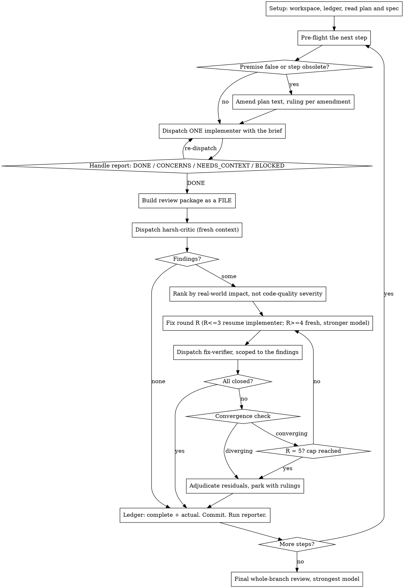

# Orchestrating Plans

You are the orchestrator. You do not write the deliverable; you decide what gets built next,
against what premises, and whether what came back is real.

Announce once at the start: "Using orchestrating-plans to execute <plan file>."

## Why this exists

A plan is written before the code exists. By step twelve, several of its premises are false --
signatures it invented, directories it expected, tool versions it assumed. Executing a stale
premise costs a full review loop to discover and a full fix loop to undo. The single highest
-value thing an orchestrator does is check the plan's premises against the tree **immediately
before** each dispatch, not once at the start.

Measured on the project this skill was extracted from: steps that got a pre-flight pass ran at
about 1.35x their estimate; steps that did not ran at about 3.25x. The overhead of pre-flight is
minutes. The cost of skipping it is fix rounds.

## Roles

| Role | Who does it | Why |
|---|---|---|
| Orchestrator | you, in this session | needs continuity across the whole plan, talks to the human, owns the ledger |
| Pre-flight | delegated worker (`step-preflight`) | must read the tree fresh, without your assumptions about it |
| Implementer | delegated worker | isolated context; never inherits your history |
| Critic | delegated worker (`harsh-critic`) | **must not share your reasoning**, or it inherits your blind spots |
| Verifier | delegated worker (`fix-verifier`) | must reproduce claims, not read them |
| Reporter | delegated worker (`plan-progress-reporter`) | read-only; reconciles plan, ledger and history |

**The decisive rule.** Anything that judges the work runs in a context you do not share. Anything
that needs continuity across steps stays with you. You may not "play the part" of the critic: a
reviewer that inherited your reasoning about why the code is right will agree with it.

## Setup

1. Work in an isolated branch or worktree. Never start on a shared default branch without the
   human's explicit consent.
2. Create the plan's workspace: `<repo-root>/.plan-execution/<plan-basename>/`. Everything for
   this plan lives there -- ledger, briefs, reports, review packages, pre-flight tables. Add it
   to the repo's ignore file if it is not already covered. Another plan's directory is never
   yours to read or write.
3. Create or resume the ledger at `<workspace>/progress.md`. Its FIRST line is its identity:
   `# Execution ledger -- plan: <plan file path>`. If an existing ledger's first line names a
   different plan, leave it alone and start your own.
4. Read the plan once. If it names a spec, read that too: **the spec is the binding authority,
   the plan is only its argument.** A plan with no reachable spec gets a ledger note saying so;
   rulings made without one are provisional.
5. Create one task item per step.

**The ledger is your recovery map.** Conversation memory does not survive compaction; the ledger
and `git log` do. After a compaction, trust them over your own recollection. The most expensive
failure observed in practice is an orchestrator that lost its place and re-dispatched a completed
sequence.

Ledger entries you must write:

- `Step <id>: complete` -- the only marker that means done. Resume at the first step without one.
- `Step <id> actual: <X>h` -- the worker's own working time, measured from dispatch results.
- `Ruling <n>: <decision> -- <why> -- <what it costs if wrong>` -- numbered, monotonic, never
  renumbered. Rulings are binding on every later step and on every later reviewer.
- `NEEDS-HUMAN <n>: <question> -- <why it cannot be ruled> -- <what is blocked>`.

## Rulings, not stalls

A running plan does not wait on a human. Conflicts, ambiguities, plan defects, a cap you would
have asked to exceed -- decide them, record the ruling, keep going. A wrong ruling costs rework
the human can see and undo. A session parked on a question costs their whole day.

Four things stop you, and only these:

1. an irreversible or destructive operation;
2. a security-sensitive action;
3. a side effect outside this workspace that norms say you ask about first (a merge, a push to a
   shared branch, a publish, a deploy);
4. a plan so broken that every path forward is a guess.

## The human-decision queue

Some questions genuinely need the human but do not block the current step. Do not interrupt for
each one. Pre-flight emits them, you accumulate them in the ledger as `NEEDS-HUMAN <n>`, and you
put them to the human **as one batch** at the next natural boundary -- a milestone end, a pause
they asked for, or the moment one of them starts blocking.

A question qualifies for the queue only if it is (a) outside your authority -- a product
decision, a cost, a hardware fact you cannot measure -- and (b) not blocking. If it blocks, rule
on it and record what it costs if wrong. If it is inside your authority, rule on it now.

## The loop

## 1. Pre-flight -- before every dispatch

Run `scripts/task-brief PLAN_FILE STEP_ID` to extract the step's full text to its own file. Then
dispatch the `step-preflight` worker with: the brief path, the paths to the project's guideline
files, the ledger path, and the output path for its table.

**Pre-flight reports; it does not decide.** An agent that both finds a problem and chooses the
fix tends to find the problems it already knows how to fix. It returns a premise table; you rule.

You read its table and, for each false premise, do exactly one of:

- **Amend the plan text** and record `Ruling <n>` naming what was stale, what it now says, and
  what it costs if the amendment is wrong.
- **Carry the correction into the dispatch** without amending the plan, when the plan text is
  still right in general and only this step's wording is off.
- **Queue it** as `NEEDS-HUMAN <n>` when it is outside your authority and not blocking.

**Plan-amendment discipline.** Amend only because a premise is stale or a decision has been
superseded by a ruling. **Never amend to reduce scope** because the step turned out to be harder
than the plan thought -- that is the human's call, not yours; raise it as `NEEDS-HUMAN`. Every
amendment names the ruling that authorises it. An unauthorised amendment is indistinguishable
from quietly dropping work.

Skip pre-flight only for a step whose text contains the complete content to write and touches
nothing another step created. Record the skip in the ledger with one line of reasoning.

## 2. Dispatch the implementer

Record BASE (`git rev-parse HEAD`) before dispatching -- review packages and fix diffs need it,
and `HEAD~1` silently truncates a multi-commit step.

A dispatch contains, and contains only:

1. one line on where this step sits in the project;
2. the brief path, introduced as "read this first -- it is your requirements, and its exact
   values are to be used verbatim";
3. interfaces and decisions from earlier steps that the brief cannot know;
4. your pre-flight rulings and your resolution of any ambiguity;
5. any standing constraints that bind every step (copy them verbatim -- they are the worker's
   attention lens);
6. the report-file path and the report contract.

**Never paste session history into a dispatch.** One real dispatch reached 42,000 characters of
which 99% was accumulated prior-step summaries. A fresh worker needs its step, the interfaces it
touches, and the constraints. Nothing else. Everything you paste in, and everything a worker
prints back, stays resident in your context and is re-read on every later turn -- hand artifacts
over as file paths.

**Never dispatch two implementers in parallel.** They conflict in the tree, and the resulting
merge is unreviewable.

**Never let a worker dispatch its own reviewer.** Review comes from you, after the report. Every
reviewer a worker spawned in practice duplicated the review the orchestrator dispatched anyway.

**Never inspect the tree while a worker holds it.** A read is safe; an edit is not. An edit made
while an implementer or verifier still has the tree gets clobbered when they write, and the loss
is silent.

Handle the four report statuses:

- **DONE** -- build the review package, dispatch the critic.
- **DONE_WITH_CONCERNS** -- read the concerns first. Correctness or scope concerns get addressed
  before review; observations get noted and you proceed.
- **NEEDS_CONTEXT** -- supply what was missing, re-dispatch.
- **BLOCKED** -- assess: missing context (re-dispatch with it), insufficient reasoning
  (re-dispatch on a stronger model), too large (split it), or the plan is wrong (rule, ledger,
  re-dispatch carrying the ruling). Never force the same worker to retry unchanged.

**Check the completion contract.** Workers fail their own contract silently: a fixer that was
told to write a report and did not, a step that claimed tests pass without running them. Before
you accept a report, confirm the artifacts it was required to produce actually exist on disk. A
missing report is a failed dispatch, not a stylistic lapse.

## 3. Review

Build the review package as a **file** (`scripts/review-package PLAN_FILE BASE HEAD`): the commit
list, the stat summary, and the full diff with context, in one file the critic reads in one call.
Never dispatch a critic without one.

The critic gets: the brief, the implementer's report, the review package, and the binding
constraints. It gets no explanation from you of why the code is right.

**Rank findings by real-world impact, not by code-quality severity.** A finding labelled MEDIUM
that changes what a shipped device does in the field outranks a HIGH about test structure. In
practice the most dangerous findings arrive under a "zero HIGH" headline, which reads as a pass
and is not one.

## 4. Fix and verify

- Rounds 1-3: resume the same implementer -- it has the context.
- Rounds 4-5: fresh worker, at least one tier stronger. The one that got stuck stays stuck.
- Cap at 5 rounds. Do not raise the cap; do not lower it either. In measured practice, round 4
  on the steps that reached it found genuine field-affecting defects both times, so a 3-round cap
  would have shipped them.
- Every round ends with a `fix-verifier` dispatch scoped to the specific findings. The verifier
  **reproduces**; it does not read the fixer's account. Where a finding was about coverage, it
  checks every case, not a sample -- a review that sampled four of eighteen mutants missed the
  ones that mattered and took three extra rounds to converge.

**Scope discipline in later rounds.** Findings about things that are not the deliverable --
test-harness structure, tooling ergonomics, documentation of the tooling -- may be raised in
round 1 only. Re-reviews may verify that a round-1 fix landed; they may not open new
non-deliverable findings. Left unchecked, this is where a review loop turns into building
tooling about tooling.

**In tooling, fix the instance, not the class.** When a finding is in the support scaffolding
rather than the product, fix that instance and stop. Building a general gate against the class of
mistake is how one two-commit fix became seven commits.

**Convergence check.** Each round, ask: are this round's findings in the deliverable, or in the
infrastructure the previous round added? Two consecutive rounds of the second kind means the loop
is feeding itself. Stop, adjudicate the open findings, park them with rulings, and move on.

## 5. Close the step

Ledger: `Step <id>: complete`, the measured actual, any rulings, any parked findings with the
ruling that parked them. Commit. Then run the reporter and put its tables in front of the human.
A step is not finished until its report has been shown.

## Model selection

Always name the model explicitly on every dispatch. An omitted model inherits your session's
model -- usually the most expensive one -- which silently defeats this section.

| Work | Tier |
|---|---|
| Step text contains the complete content to write | cheapest |
| Single-file mechanical fix | cheapest |
| 1-2 files, complete spec | cheap |
| Multi-file with integration concerns | mid |
| Pre-flight | mid |
| Critic and verifier | mid, scaled up for subtle or high-risk diffs |
| Design judgement, broad codebase understanding | strongest |
| Final whole-branch review | strongest |
| Fix rounds 4-5 | one tier above the worker that got stuck |

Turn count beats token price: the cheapest models often take two to three times the turns on
multi-step work and cost more overall. Mid-tier is the floor for reviewers and for implementers
working from prose rather than from complete given content.

## Waiting

While you have local work -- ledger updates, packaging the next review, reading reports -- keep
working; results arrive on their own. When genuinely idle, wait in bounded stretches rather than
one open-ended wait, and between stretches post one line of status and reconcile your live
workers: list them and chase any that finished without reporting. Never poll on short timeouts.

## Defect patterns to hunt

These are the ones that survive ordinary review. Every critic and verifier dispatch should carry
this list.

1. **The gate that cannot fail.** A check, test, assertion or CI job that would pass no matter
   what the code did: a test that asserts nothing, a linter pointed at no files, a pipeline step
   on a trigger that never fires, a coverage threshold never enforced. This is the single most
   common serious defect -- one project found 26 instances in its first milestone.
2. **A gate that scanned nothing must FAIL, not pass.** Zero files matched, zero tests
   discovered, an empty diff: report it as a failure. `discover` printing "Ran 0 tests ... OK"
   and exiting 0 is the canonical shape.
3. **A mechanism that looks configured and does nothing.** A config key the tool silently
   ignores; a stanza after a document-end marker; an option that was renamed upstream. Verify a
   new configuration key against the installed tool, never against memory.
4. **A comment or docstring describing a protection the code does not implement.** The
   documentation is the only place the protection exists.
5. **A diagnostic that says nothing under failure.** An error message interpolating variables
   nothing sets, so it prints blanks exactly when someone needs it.
6. **Environment contamination.** A gate that "passed" using a different tool than the pinned
   one has proven nothing. On one project a stray toolchain on the developer's PATH bypassed
   gates four separate times. Every dispatch that runs a build or a gate must report **which**
   binary it used and its version, and the orchestrator checks that against the pin.
7. **Silent widening.** A default that makes an undefined thing empty rather than an error -- an
   unset variable expanding to the empty string, a missing key returning null, an absent tool
   treated as "nothing to check".

## Red flags

| Thought | Reality |
|---|---|
| "The plan says X, so X is true" | The plan was written before the code existed. Pre-flight it. |
| "I already know what is in that file" | You knew at some earlier step. Have pre-flight look. |
| "I can review this myself, I know what it should do" | That is exactly why you cannot. Dispatch a critic. |
| "The fixer says it is fixed" | Verify by reproducing. Accounts are not evidence. |
| "The critic found nothing, so it is clean" | Finding nothing is a signal the review was shallow. Send it back to the error paths and the cold-start path. |
| "Zero HIGH findings, so this is a pass" | Rank by field impact. The dangerous ones hide under that headline. |
| "This step is bigger than planned, I will trim it" | Scope reduction is the human's call. Queue it. |
| "I will paste the last three steps' state so it has context" | A fresh worker needs its step and its interfaces. History is pure cost. |
| "Two implementers would be faster" | They conflict. Never in parallel. |
| "I will just fix this one thing while the worker runs" | Your edit gets clobbered silently. Read only. |
| "Let me build a check so this class of mistake cannot recur" | In tooling, fix the instance. That instinct is how a loop stops converging. |
